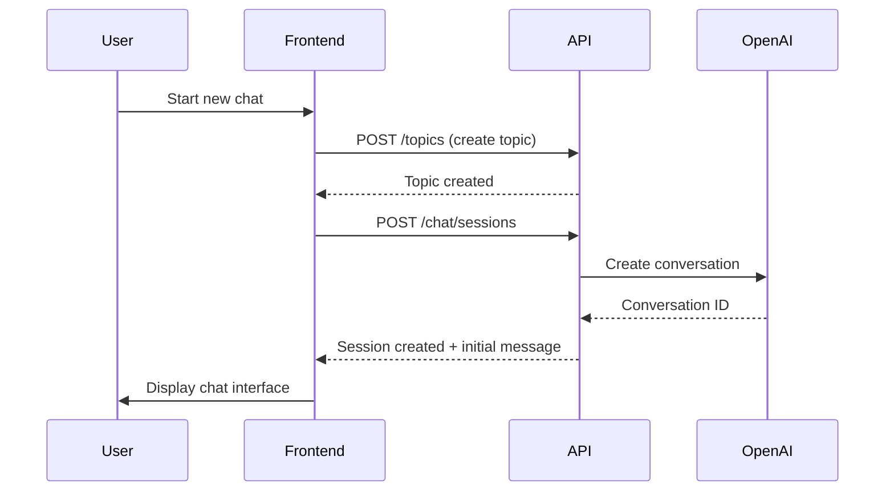
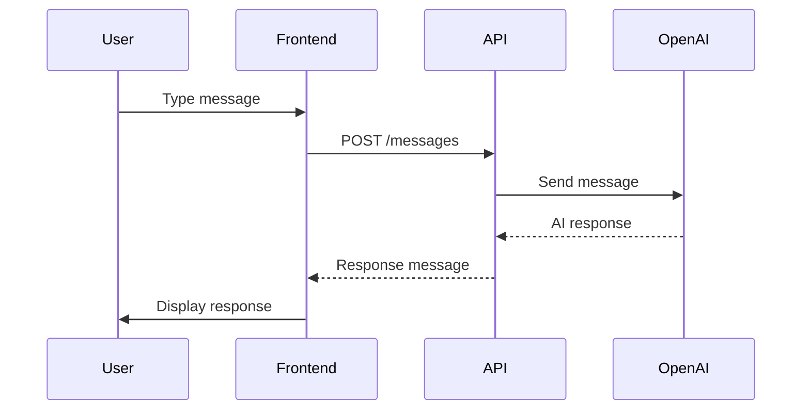

# Intelligence Module - Chat Implementation Guide for Frontend

## Overview
The Intelligence module provides AI-powered chat functionality that allows users to create topics, start chat sessions with customizable AI personas, and maintain conversation histories. This guide covers the complete frontend implementation.

## Table of Contents
1. [API Endpoints](#api-endpoints)
2. [Authentication](#authentication)
3. [Core Workflows](#core-workflows)
4. [TypeScript Interfaces](#typescript-interfaces)
5. [React Implementation Example](#react-implementation-example)
6. [Error Handling](#error-handling)
7. [Best Practices](#best-practices)

## API Endpoints

### Base URL
```
Development: http://localhost:20000
Production: https://api.yourdomain.com
```

### Intelligence Chat Endpoints

#### 1. Create Topic
```http
POST /api/intelligence/topics
Authorization: Bearer {token}
Content-Type: application/json

{
  "id": "unique-topic-id"
}

Response: 201 Created
{
  "id": "unique-topic-id",
  "createdAt": "2025-09-21T15:42:05.830Z",
  "updatedAt": "2025-09-21T15:42:05.830Z"
}
```

#### 2. Create Chat Session
```http
POST /api/intelligence/chat/sessions
Authorization: Bearer {token}
Content-Type: application/json

{
  "topicId": "unique-topic-id",
  "persona": {
    "name": "Research Assistant",
    "instructions": "You are a helpful AI research assistant.",
    "role": "system" | "developer"  // optional, defaults to "system"
  },
  "initialMessage": "Hello! Can you help me understand quantum computing?",
  "metadata": {
    "sessionName": "Quantum Research",
    "category": "Science"
  }
}

Response: 201 Created
{
  "topicId": "unique-topic-id",
  "conversationId": "conv_68d01cced...",
  "message": "Hello! I'd be happy to help you understand quantum computing..."
}
```

#### 3. Send Message
```http
POST /api/intelligence/topics/{topicId}/conversations/{conversationId}/messages
Authorization: Bearer {token}
Content-Type: application/json

{
  "message": "Can you give me a practical example?",
  "temperature": 0.7  // optional, 0-2, controls response creativity
}

Response: 200 OK
{
  "message": "Sure! Here's a practical example of quantum computing...",
  "conversationId": "conv_68d01cced...",
  "topicId": "unique-topic-id",
  "timestamp": "2025-09-21T15:42:10.123Z"
}
```

#### 4. Get Conversation History
```http
GET /api/intelligence/topics/{topicId}/conversations/{conversationId}/history
Authorization: Bearer {token}

Response: 200 OK
{
  "topicId": "unique-topic-id",
  "conversationId": "conv_68d01cced...",
  "messages": [
    {
      "id": "msg_123_user",
      "role": "user",
      "content": "Hello! Can you help me understand quantum computing?",
      "timestamp": "2025-09-21T15:42:06.123Z"
    },
    {
      "id": "msg_123_assistant",
      "role": "assistant",
      "content": "Hello! I'd be happy to help...",
      "timestamp": "2025-09-21T15:42:07.456Z"
    }
  ]
}
```

#### 5. List Topic Conversations
```http
GET /api/intelligence/topics/{topicId}/conversations
Authorization: Bearer {token}

Response: 200 OK
[
  {
    "id": "conv_relation_123",
    "topicId": "unique-topic-id",
    "conversationId": "conv_68d01cced...",
    "provider": "openai",
    "createdAt": "2025-09-21T15:42:05.830Z"
  }
]
```

#### 6. Get Topic Details
```http
GET /api/intelligence/topics/{topicId}
Authorization: Bearer {token}

Response: 200 OK
{
  "id": "unique-topic-id",
  "createdAt": "2025-09-21T15:42:05.830Z",
  "updatedAt": "2025-09-21T15:42:05.830Z",
  "schemas": [],
  "inputs": [],
  "conversations": [...],
  "notes": [...]
}
```

#### 7. Add Note to Topic
```http
POST /api/intelligence/topics/{topicId}/notes
Authorization: Bearer {token}
Content-Type: application/json

{
  "note": "Important insight about the discussion..."
}

Response: 201 Created
{
  "id": "note_123",
  "topicId": "unique-topic-id",
  "note": "Important insight about the discussion...",
  "createdAt": "2025-09-21T15:42:20.123Z"
}
```

## Authentication

### Login Flow
```typescript
// 1. Login to get tokens
const loginResponse = await fetch('/auth/login', {
  method: 'POST',
  headers: { 'Content-Type': 'application/json' },
  body: JSON.stringify({
    email: 'user@example.com',
    password: 'password123'
  })
});

const { accessToken, refreshToken } = await loginResponse.json();

// 2. Store tokens securely
localStorage.setItem('accessToken', accessToken);
localStorage.setItem('refreshToken', refreshToken);

// 3. Use token in subsequent requests
const headers = {
  'Authorization': `Bearer ${accessToken}`,
  'Content-Type': 'application/json'
};
```

## Core Workflows

### Workflow 1: Starting a New AI Chat


### Workflow 2: Continuing a Conversation


## TypeScript Interfaces

```typescript
// Topic interfaces
interface IntelligenceTopic {
  id: string;
  createdAt: string;
  updatedAt: string;
}

interface TopicWithRelations extends IntelligenceTopic {
  schemas: IntelligenceTopicSchema[];
  inputs: IntelligenceTopicInput[];
  conversations: IntelligenceTopicConversation[];
  notes: IntelligenceTopicNote[];
}

// Chat interfaces
interface CreateChatSessionRequest {
  topicId: string;
  persona?: {
    name: string;
    instructions?: string;
    role?: 'system' | 'developer';
  };
  initialMessage?: string;
  metadata?: Record<string, string>;
}

interface ChatSessionResponse {
  topicId: string;
  conversationId: string;
  message?: string;
}

interface SendMessageRequest {
  message: string;
  temperature?: number; // 0-2
}

interface MessageResponse {
  message: string;
  conversationId: string;
  topicId: string;
  timestamp: string;
}

interface ConversationMessage {
  id: string;
  role: 'user' | 'assistant' | 'system';
  content: string;
  timestamp: string;
  model?: string;
  usage?: any;
}

interface ConversationHistory {
  topicId: string;
  conversationId: string;
  messages: ConversationMessage[];
}

// Note interfaces
interface IntelligenceTopicNote {
  id: string;
  topicId: string;
  note: string;
  createdAt: string;
  updatedAt: string;
}
```

## React Implementation Example

### 1. Chat Service
```typescript
// services/intelligenceChat.service.ts
class IntelligenceChatService {
  private baseUrl = process.env.REACT_APP_API_URL;

  private async request(url: string, options: RequestInit = {}) {
    const token = localStorage.getItem('accessToken');
    const response = await fetch(`${this.baseUrl}${url}`, {
      ...options,
      headers: {
        'Authorization': `Bearer ${token}`,
        'Content-Type': 'application/json',
        ...options.headers,
      },
    });

    if (!response.ok) {
      const error = await response.json();
      throw new Error(error.message || 'Request failed');
    }

    return response.json();
  }

  async createTopic(topicId: string) {
    return this.request('/api/intelligence/topics', {
      method: 'POST',
      body: JSON.stringify({ id: topicId }),
    });
  }

  async createChatSession(params: CreateChatSessionRequest) {
    return this.request('/api/intelligence/chat/sessions', {
      method: 'POST',
      body: JSON.stringify(params),
    });
  }

  async sendMessage(
    topicId: string,
    conversationId: string,
    message: string,
    temperature?: number
  ) {
    return this.request(
      `/api/intelligence/topics/${topicId}/conversations/${conversationId}/messages`,
      {
        method: 'POST',
        body: JSON.stringify({ message, temperature }),
      }
    );
  }

  async getConversationHistory(topicId: string, conversationId: string) {
    return this.request(
      `/api/intelligence/topics/${topicId}/conversations/${conversationId}/history`
    );
  }

  async getTopicConversations(topicId: string) {
    return this.request(`/api/intelligence/topics/${topicId}/conversations`);
  }

  async addNote(topicId: string, note: string) {
    return this.request(`/api/intelligence/topics/${topicId}/notes`, {
      method: 'POST',
      body: JSON.stringify({ note }),
    });
  }
}

export const intelligenceChatService = new IntelligenceChatService();
```

### 2. React Hook for Chat
```typescript
// hooks/useIntelligenceChat.ts
import { useState, useEffect, useCallback } from 'react';
import { intelligenceChatService } from '../services/intelligenceChat.service';

export function useIntelligenceChat(topicId?: string) {
  const [loading, setLoading] = useState(false);
  const [error, setError] = useState<string | null>(null);
  const [conversationId, setConversationId] = useState<string | null>(null);
  const [messages, setMessages] = useState<ConversationMessage[]>([]);

  // Initialize chat session
  const initializeChat = useCallback(async (
    topicId: string,
    persona?: any,
    initialMessage?: string
  ) => {
    setLoading(true);
    setError(null);

    try {
      // Create topic first
      await intelligenceChatService.createTopic(topicId);

      // Create chat session
      const session = await intelligenceChatService.createChatSession({
        topicId,
        persona,
        initialMessage,
      });

      setConversationId(session.conversationId);

      // Add initial messages if any
      if (initialMessage) {
        setMessages([
          {
            id: `user_${Date.now()}`,
            role: 'user',
            content: initialMessage,
            timestamp: new Date().toISOString(),
          },
          {
            id: `assistant_${Date.now()}`,
            role: 'assistant',
            content: session.message || '',
            timestamp: new Date().toISOString(),
          },
        ]);
      }

      return session;
    } catch (err: any) {
      setError(err.message);
      throw err;
    } finally {
      setLoading(false);
    }
  }, []);

  // Send message
  const sendMessage = useCallback(async (
    message: string,
    temperature = 0.7
  ) => {
    if (!topicId || !conversationId) {
      throw new Error('Chat session not initialized');
    }

    setLoading(true);
    setError(null);

    // Optimistically add user message
    const userMessage: ConversationMessage = {
      id: `user_${Date.now()}`,
      role: 'user',
      content: message,
      timestamp: new Date().toISOString(),
    };

    setMessages(prev => [...prev, userMessage]);

    try {
      const response = await intelligenceChatService.sendMessage(
        topicId,
        conversationId,
        message,
        temperature
      );

      // Add assistant response
      const assistantMessage: ConversationMessage = {
        id: `assistant_${Date.now()}`,
        role: 'assistant',
        content: response.message,
        timestamp: response.timestamp,
      };

      setMessages(prev => [...prev, assistantMessage]);

      return response;
    } catch (err: any) {
      setError(err.message);
      // Remove optimistic message on error
      setMessages(prev => prev.filter(m => m.id !== userMessage.id));
      throw err;
    } finally {
      setLoading(false);
    }
  }, [topicId, conversationId]);

  // Load conversation history
  const loadHistory = useCallback(async () => {
    if (!topicId || !conversationId) return;

    setLoading(true);
    setError(null);

    try {
      const history = await intelligenceChatService.getConversationHistory(
        topicId,
        conversationId
      );
      setMessages(history.messages);
    } catch (err: any) {
      setError(err.message);
    } finally {
      setLoading(false);
    }
  }, [topicId, conversationId]);

  // Load history on mount if conversation exists
  useEffect(() => {
    if (topicId && conversationId) {
      loadHistory();
    }
  }, [topicId, conversationId, loadHistory]);

  return {
    loading,
    error,
    conversationId,
    messages,
    initializeChat,
    sendMessage,
    loadHistory,
  };
}
```

### 3. Chat Component
```tsx
// components/IntelligenceChat.tsx
import React, { useState, useRef, useEffect } from 'react';
import { useIntelligenceChat } from '../hooks/useIntelligenceChat';

interface IntelligenceChatProps {
  topicId?: string;
  persona?: {
    name: string;
    instructions?: string;
    role?: 'system' | 'developer';
  };
  onError?: (error: string) => void;
}

export function IntelligenceChat({
  topicId: initialTopicId,
  persona,
  onError
}: IntelligenceChatProps) {
  const [input, setInput] = useState('');
  const [topicId, setTopicId] = useState(initialTopicId);
  const [isInitialized, setIsInitialized] = useState(false);
  const messagesEndRef = useRef<HTMLDivElement>(null);

  const {
    loading,
    error,
    conversationId,
    messages,
    initializeChat,
    sendMessage,
  } = useIntelligenceChat(topicId);

  // Auto-scroll to bottom
  const scrollToBottom = () => {
    messagesEndRef.current?.scrollIntoView({ behavior: 'smooth' });
  };

  useEffect(() => {
    scrollToBottom();
  }, [messages]);

  useEffect(() => {
    if (error && onError) {
      onError(error);
    }
  }, [error, onError]);

  // Initialize chat on mount
  useEffect(() => {
    if (!isInitialized && !conversationId) {
      const newTopicId = topicId || `chat_${Date.now()}`;
      setTopicId(newTopicId);

      initializeChat(
        newTopicId,
        persona,
        persona ? `Hello! I'm ${persona.name}. How can I help you today?` : undefined
      ).then(() => {
        setIsInitialized(true);
      }).catch(console.error);
    }
  }, [topicId, persona, conversationId, isInitialized, initializeChat]);

  const handleSubmit = async (e: React.FormEvent) => {
    e.preventDefault();
    if (!input.trim() || loading) return;

    const message = input;
    setInput('');

    try {
      await sendMessage(message);
    } catch (err) {
      console.error('Failed to send message:', err);
    }
  };

  const handleKeyPress = (e: React.KeyboardEvent) => {
    if (e.key === 'Enter' && !e.shiftKey) {
      e.preventDefault();
      handleSubmit(e as any);
    }
  };

  return (
    <div className="intelligence-chat">
      <div className="chat-header">
        {persona && (
          <div className="persona-info">
            <h3>{persona.name}</h3>
            <p className="text-sm text-gray-500">{persona.instructions}</p>
          </div>
        )}
        {conversationId && (
          <p className="text-xs text-gray-400">
            Session: {conversationId.substring(0, 20)}...
          </p>
        )}
      </div>

      <div className="chat-messages">
        {messages.map((message) => (
          <div
            key={message.id}
            className={`message ${message.role === 'user' ? 'user' : 'assistant'}`}
          >
            <div className="message-role">
              {message.role === 'user' ? 'You' : persona?.name || 'Assistant'}
            </div>
            <div className="message-content">{message.content}</div>
            <div className="message-timestamp">
              {new Date(message.timestamp).toLocaleTimeString()}
            </div>
          </div>
        ))}

        {loading && (
          <div className="message assistant loading">
            <div className="typing-indicator">
              <span></span>
              <span></span>
              <span></span>
            </div>
          </div>
        )}

        <div ref={messagesEndRef} />
      </div>

      <form className="chat-input-form" onSubmit={handleSubmit}>
        <textarea
          value={input}
          onChange={(e) => setInput(e.target.value)}
          onKeyPress={handleKeyPress}
          placeholder="Type your message..."
          rows={2}
          disabled={loading || !conversationId}
          className="chat-input"
        />
        <button
          type="submit"
          disabled={loading || !input.trim() || !conversationId}
          className="send-button"
        >
          {loading ? 'Sending...' : 'Send'}
        </button>
      </form>

      {error && (
        <div className="error-message">
          Error: {error}
        </div>
      )}
    </div>
  );
}
```

### 4. CSS Styles
```css
/* styles/IntelligenceChat.css */
.intelligence-chat {
  display: flex;
  flex-direction: column;
  height: 100%;
  max-height: 600px;
  border: 1px solid #e5e5e5;
  border-radius: 8px;
  overflow: hidden;
}

.chat-header {
  padding: 16px;
  background: #f9fafb;
  border-bottom: 1px solid #e5e5e5;
}

.persona-info h3 {
  margin: 0 0 4px 0;
  font-size: 18px;
  font-weight: 600;
}

.chat-messages {
  flex: 1;
  overflow-y: auto;
  padding: 16px;
  background: white;
}

.message {
  margin-bottom: 16px;
  animation: fadeIn 0.3s ease-in;
}

@keyframes fadeIn {
  from { opacity: 0; transform: translateY(10px); }
  to { opacity: 1; transform: translateY(0); }
}

.message.user {
  text-align: right;
}

.message.assistant {
  text-align: left;
}

.message-role {
  font-size: 12px;
  font-weight: 600;
  color: #6b7280;
  margin-bottom: 4px;
}

.message-content {
  display: inline-block;
  padding: 8px 12px;
  border-radius: 8px;
  max-width: 70%;
  word-wrap: break-word;
}

.message.user .message-content {
  background: #3b82f6;
  color: white;
  text-align: left;
}

.message.assistant .message-content {
  background: #f3f4f6;
  color: #111827;
}

.message-timestamp {
  font-size: 11px;
  color: #9ca3af;
  margin-top: 4px;
}

.typing-indicator {
  display: inline-flex;
  gap: 4px;
  padding: 12px;
}

.typing-indicator span {
  width: 8px;
  height: 8px;
  background: #9ca3af;
  border-radius: 50%;
  animation: typing 1.4s infinite;
}

.typing-indicator span:nth-child(2) {
  animation-delay: 0.2s;
}

.typing-indicator span:nth-child(3) {
  animation-delay: 0.4s;
}

@keyframes typing {
  0%, 60%, 100% {
    transform: translateY(0);
    opacity: 0.7;
  }
  30% {
    transform: translateY(-10px);
    opacity: 1;
  }
}

.chat-input-form {
  display: flex;
  gap: 8px;
  padding: 16px;
  background: #f9fafb;
  border-top: 1px solid #e5e5e5;
}

.chat-input {
  flex: 1;
  padding: 8px 12px;
  border: 1px solid #d1d5db;
  border-radius: 6px;
  resize: none;
  font-family: inherit;
  font-size: 14px;
}

.chat-input:focus {
  outline: none;
  border-color: #3b82f6;
  box-shadow: 0 0 0 3px rgba(59, 130, 246, 0.1);
}

.send-button {
  padding: 8px 20px;
  background: #3b82f6;
  color: white;
  border: none;
  border-radius: 6px;
  font-weight: 500;
  cursor: pointer;
  transition: background 0.2s;
}

.send-button:hover:not(:disabled) {
  background: #2563eb;
}

.send-button:disabled {
  opacity: 0.5;
  cursor: not-allowed;
}

.error-message {
  padding: 12px 16px;
  background: #fef2f2;
  color: #dc2626;
  border-top: 1px solid #fecaca;
  font-size: 14px;
}
```

## Error Handling

### Common Error Scenarios

1. **Authentication Errors**
```typescript
// Handle 401 Unauthorized
if (response.status === 401) {
  // Token expired - try refresh
  const newToken = await refreshAccessToken();
  if (newToken) {
    // Retry request with new token
    return retryRequest(url, options, newToken);
  } else {
    // Redirect to login
    window.location.href = '/login';
  }
}
```

2. **Network Errors**
```typescript
try {
  const response = await sendMessage(message);
} catch (error) {
  if (error instanceof TypeError && error.message === 'Failed to fetch') {
    // Network error
    showNotification('Network error. Please check your connection.');
  } else {
    // API error
    showNotification(error.message || 'An error occurred');
  }
}
```

3. **Rate Limiting**
```typescript
if (response.status === 429) {
  const retryAfter = response.headers.get('Retry-After');
  showNotification(`Rate limited. Please wait ${retryAfter} seconds.`);

  // Implement exponential backoff
  setTimeout(() => {
    retryRequest(url, options);
  }, parseInt(retryAfter) * 1000);
}
```

## Best Practices

### 1. State Management
Use Redux or Zustand for complex chat state:

```typescript
// store/intelligenceChatSlice.ts
import { create } from 'zustand';

interface ChatState {
  topics: Map<string, TopicWithRelations>;
  conversations: Map<string, ConversationHistory>;
  activeTopicId: string | null;
  activeConversationId: string | null;

  setActiveTopic: (topicId: string) => void;
  addMessage: (conversationId: string, message: ConversationMessage) => void;
  updateConversation: (conversationId: string, data: Partial<ConversationHistory>) => void;
}

export const useChatStore = create<ChatState>((set) => ({
  topics: new Map(),
  conversations: new Map(),
  activeTopicId: null,
  activeConversationId: null,

  setActiveTopic: (topicId) => set({ activeTopicId: topicId }),

  addMessage: (conversationId, message) => set((state) => {
    const conversation = state.conversations.get(conversationId);
    if (conversation) {
      conversation.messages.push(message);
      state.conversations.set(conversationId, { ...conversation });
    }
    return { conversations: new Map(state.conversations) };
  }),

  updateConversation: (conversationId, data) => set((state) => {
    const conversation = state.conversations.get(conversationId);
    if (conversation) {
      state.conversations.set(conversationId, { ...conversation, ...data });
    }
    return { conversations: new Map(state.conversations) };
  }),
}));
```

### 2. Optimistic Updates
Show messages immediately for better UX:

```typescript
const sendMessage = async (message: string) => {
  // Add message optimistically
  const optimisticMessage = {
    id: `temp_${Date.now()}`,
    content: message,
    role: 'user',
    timestamp: new Date().toISOString(),
    pending: true,
  };

  addMessage(optimisticMessage);

  try {
    const response = await api.sendMessage(message);
    // Replace optimistic message with real one
    replaceMessage(optimisticMessage.id, response);
  } catch (error) {
    // Mark message as failed
    markMessageFailed(optimisticMessage.id);
  }
};
```

### 3. Message Formatting
Support markdown and code highlighting:

```typescript
import ReactMarkdown from 'react-markdown';
import { Prism as SyntaxHighlighter } from 'react-syntax-highlighter';

function MessageContent({ content }: { content: string }) {
  return (
    <ReactMarkdown
      components={{
        code({ node, inline, className, children, ...props }) {
          const match = /language-(\w+)/.exec(className || '');
          return !inline && match ? (
            <SyntaxHighlighter
              language={match[1]}
              PreTag="div"
              {...props}
            >
              {String(children).replace(/\n$/, '')}
            </SyntaxHighlighter>
          ) : (
            <code className={className} {...props}>
              {children}
            </code>
          );
        },
      }}
    >
      {content}
    </ReactMarkdown>
  );
}
```

### 4. Persistent Storage
Save conversations locally:

```typescript
// Save to IndexedDB for offline access
import { openDB } from 'idb';

const db = await openDB('IntelligenceChat', 1, {
  upgrade(db) {
    db.createObjectStore('conversations', { keyPath: 'id' });
    db.createObjectStore('topics', { keyPath: 'id' });
  },
});

// Save conversation
await db.put('conversations', {
  id: conversationId,
  messages,
  lastUpdated: new Date().toISOString(),
});

// Load on app start
const savedConversations = await db.getAll('conversations');
```

### 5. WebSocket for Real-time Updates
For real-time streaming responses:

```typescript
// services/websocket.service.ts
class WebSocketService {
  private ws: WebSocket | null = null;

  connect(conversationId: string) {
    const token = localStorage.getItem('accessToken');
    this.ws = new WebSocket(
      `wss://api.yourdomain.com/ws?token=${token}&conversation=${conversationId}`
    );

    this.ws.onmessage = (event) => {
      const data = JSON.parse(event.data);

      if (data.type === 'message.chunk') {
        // Handle streaming response
        appendToLastMessage(data.content);
      } else if (data.type === 'message.complete') {
        // Handle complete message
        finalizeMessage(data.message);
      }
    };

    return this.ws;
  }

  disconnect() {
    this.ws?.close();
    this.ws = null;
  }
}
```

### 6. Performance Optimization
```typescript
// Use React.memo for message components
const Message = React.memo(({ message }: { message: ConversationMessage }) => {
  return (
    <div className="message">
      {/* Message content */}
    </div>
  );
}, (prevProps, nextProps) => {
  // Only re-render if message content changes
  return prevProps.message.content === nextProps.message.content;
});

// Virtualize long conversations
import { FixedSizeList } from 'react-window';

function VirtualizedMessages({ messages }: { messages: ConversationMessage[] }) {
  return (
    <FixedSizeList
      height={500}
      itemCount={messages.length}
      itemSize={80}
      width="100%"
    >
      {({ index, style }) => (
        <div style={style}>
          <Message message={messages[index]} />
        </div>
      )}
    </FixedSizeList>
  );
}
```

## Testing

### Unit Tests
```typescript
// __tests__/intelligenceChat.test.ts
import { renderHook, act } from '@testing-library/react-hooks';
import { useIntelligenceChat } from '../hooks/useIntelligenceChat';

describe('useIntelligenceChat', () => {
  it('should initialize chat session', async () => {
    const { result } = renderHook(() => useIntelligenceChat());

    await act(async () => {
      await result.current.initializeChat('test-topic', {
        name: 'Test Assistant',
        instructions: 'You are a test assistant',
      });
    });

    expect(result.current.conversationId).toBeTruthy();
    expect(result.current.messages).toHaveLength(2);
  });

  it('should send message', async () => {
    const { result } = renderHook(() => useIntelligenceChat('test-topic'));

    await act(async () => {
      await result.current.sendMessage('Test message');
    });

    expect(result.current.messages).toContainEqual(
      expect.objectContaining({
        role: 'user',
        content: 'Test message',
      })
    );
  });
});
```

### Integration Tests
```typescript
// __tests__/integration/chat.test.tsx
import { render, screen, fireEvent, waitFor } from '@testing-library/react';
import { IntelligenceChat } from '../components/IntelligenceChat';

test('full chat flow', async () => {
  const { getByPlaceholderText, getByText } = render(
    <IntelligenceChat
      topicId="test-topic"
      persona={{ name: 'Test Bot' }}
    />
  );

  // Wait for initialization
  await waitFor(() => {
    expect(getByText('Test Bot')).toBeInTheDocument();
  });

  // Send a message
  const input = getByPlaceholderText('Type your message...');
  fireEvent.change(input, { target: { value: 'Hello' } });
  fireEvent.submit(input.closest('form')!);

  // Wait for response
  await waitFor(() => {
    expect(screen.getByText(/Hello/)).toBeInTheDocument();
  });
});
```

## Troubleshooting

### Common Issues and Solutions

1. **CORS Errors**
   - Ensure backend has proper CORS configuration
   - Check if credentials are included in requests

2. **Token Expiration**
   - Implement token refresh logic
   - Show user-friendly messages when re-authentication is needed

3. **Large Conversations**
   - Implement pagination for message history
   - Use virtual scrolling for performance

4. **Network Interruptions**
   - Implement retry logic with exponential backoff
   - Cache messages locally for offline access

5. **Rate Limiting**
   - Show remaining quota to users
   - Implement client-side throttling

## Conclusion

This implementation guide provides a complete foundation for integrating the Intelligence Chat module into your frontend application. The key components include:

1. **Service Layer**: Handles all API communication
2. **React Hooks**: Manages chat state and operations
3. **UI Components**: Provides interactive chat interface
4. **Error Handling**: Ensures robust user experience
5. **Performance Optimization**: Handles large conversations efficiently

Remember to adapt the code to your specific requirements, design system, and state management approach. The examples use React, but the concepts can be applied to any frontend framework.