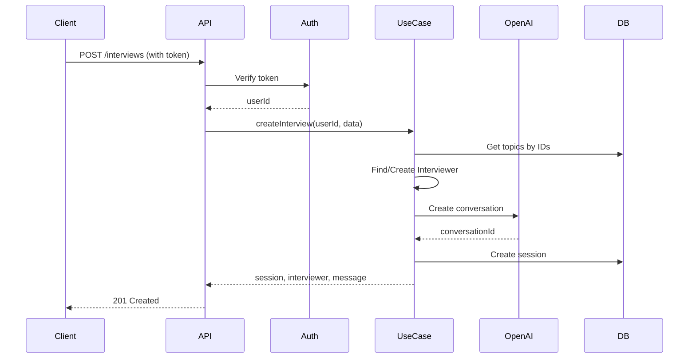
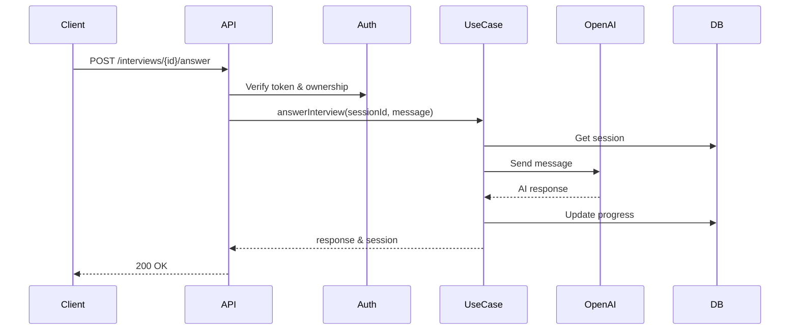

# Interview Module Documentation

## Overview
The Interview module provides a comprehensive interview session management system with OpenAI integration for conducting AI-powered mock interviews.

## Architecture

### Core Components
- **InterviewController**: Handles HTTP requests and authentication
- **InterviewUseCase**: Orchestrates business logic
- **SessionService**: Manages interview sessions
- **InterviewerService**: Manages AI interviewer personas
- **ConversationService**: OpenAI integration for AI responses

## API Endpoints

### Authentication
All interview endpoints require Bearer token authentication:
```
Authorization: Bearer <token>
```

## REST API Specification

### 1. Create Interview Session

**POST** `/api/interviews`

Creates a new interview session with selected topics and configuration.

#### Request Body
```json
{
  "topicIds": ["uuid-1", "uuid-2"],
  "title": "System Design Interview: Scalable Chat Application",
  "language": "en",
  "difficulty": 3
}
```

#### Response (201 Created)
```json
{
  "session": {
    "id": "session-uuid",
    "userId": "user-uuid",
    "topicIds": ["uuid-1", "uuid-2"],
    "title": "System Design Interview: Scalable Chat Application",
    "progress": 0,
    "score": 0,
    "targetScore": 100,
    "interviewerId": "interviewer-uuid",
    "conversationId": "conversation-uuid",
    "status": "active",
    "language": "en",
    "difficulty": 3,
    "createdAt": "2024-01-01T00:00:00Z",
    "updatedAt": "2024-01-01T00:00:00Z"
  },
  "interviewer": {
    "id": "interviewer-uuid",
    "displayName": "Senior System Design Interviewer",
    "company": "Tech Company",
    "role": "SWE",
    "seniority": "senior",
    "typeCoverage": ["tech"],
    "style": "socratic",
    "difficulty": 3,
    "language": "en"
  },
  "initialMessage": "Hello! Today we'll be discussing system design..."
}
```

### 2. Answer Interview Question

**POST** `/api/interviews/{sessionId}/answer`

Submit an answer to the current interview question.

#### Request Body
```json
{
  "message": "I would approach this problem by first understanding the scale requirements...",
  "temperature": 0.7
}
```

#### Response (200 OK)
```json
{
  "message": "That's a good start. Can you elaborate on how you would handle...",
  "session": {
    "id": "session-uuid",
    "progress": 20,
    "score": 15,
    "lastInteractionAt": "2024-01-01T00:05:00Z",
    "status": "active"
  }
}
```

### 3. Complete Interview

**POST** `/api/interviews/{sessionId}/complete`

Complete an interview session with optional final score.

#### Request Body
```json
{
  "finalScore": 85
}
```

#### Response (200 OK)
```json
{
  "id": "session-uuid",
  "status": "completed",
  "progress": 100,
  "score": 85,
  "updatedAt": "2024-01-01T00:30:00Z"
}
```

### 4. Get Interview Session

**GET** `/api/interviews/{sessionId}`

Retrieve details of a specific interview session.

#### Response (200 OK)
```json
{
  "id": "session-uuid",
  "userId": "user-uuid",
  "title": "System Design Interview",
  "status": "active",
  "progress": 40,
  "score": 35,
  "interviewerId": "interviewer-uuid",
  "conversationId": "conversation-uuid",
  "createdAt": "2024-01-01T00:00:00Z",
  "updatedAt": "2024-01-01T00:10:00Z",
  "lastInteractionAt": "2024-01-01T00:10:00Z"
}
```

### 5. List Interview Sessions

**GET** `/api/interviews`

Get a list of user's interview sessions with optional filters.

#### Query Parameters
- `status`: Filter by status (draft, active, paused, completed, archived)
- `interviewerId`: Filter by interviewer ID
- `language`: Filter by language (ko, en, ja)
- `limit`: Number of results (default: 20)
- `offset`: Pagination offset (default: 0)

## OpenAPI Specification

```yaml
openapi: 3.0.0
info:
  title: Interview API
  version: 1.0.0
  description: AI-powered mock interview platform API

servers:
  - url: https://api.example.com/api
    description: Production server
  - url: http://localhost:3000/api
    description: Development server

components:
  securitySchemes:
    bearerAuth:
      type: http
      scheme: bearer
      bearerFormat: JWT

  schemas:
    CreateInterviewRequest:
      type: object
      required:
        - topicIds
        - title
      properties:
        topicIds:
          type: array
          items:
            type: string
            format: uuid
        title:
          type: string
          minLength: 1
          maxLength: 200
        language:
          type: string
          enum: [ko, en, ja]
          default: ko
        difficulty:
          type: integer
          minimum: 1
          maximum: 5
          default: 3

    AnswerInterviewRequest:
      type: object
      required:
        - message
      properties:
        message:
          type: string
          minLength: 1
        temperature:
          type: number
          minimum: 0
          maximum: 1
          default: 0.7

    Session:
      type: object
      properties:
        id:
          type: string
          format: uuid
        userId:
          type: string
          format: uuid
        title:
          type: string
        status:
          type: string
          enum: [draft, active, paused, completed, archived]
        progress:
          type: integer
          minimum: 0
          maximum: 100
        score:
          type: integer
          minimum: 0
          maximum: 100

paths:
  /interviews:
    post:
      summary: Create new interview session
      security:
        - bearerAuth: []
      requestBody:
        required: true
        content:
          application/json:
            schema:
              $ref: '#/components/schemas/CreateInterviewRequest'
      responses:
        '201':
          description: Interview session created successfully
        '401':
          description: Unauthorized
        '400':
          description: Invalid request data

  /interviews/{sessionId}/answer:
    post:
      summary: Submit answer to interview question
      security:
        - bearerAuth: []
      parameters:
        - name: sessionId
          in: path
          required: true
          schema:
            type: string
            format: uuid
      requestBody:
        required: true
        content:
          application/json:
            schema:
              $ref: '#/components/schemas/AnswerInterviewRequest'
      responses:
        '200':
          description: Answer processed successfully
        '401':
          description: Unauthorized
        '403':
          description: Forbidden - user doesn't own this session
        '404':
          description: Session not found
```

## Client Implementation

### React Query Setup

```typescript
// hooks/useInterview.ts
import { useMutation, useQuery, useQueryClient } from '@tanstack/react-query'
import { getAuthToken } from '../auth/authService'

const API_BASE_URL = process.env.REACT_APP_API_URL || 'http://localhost:3000/api'

interface CreateInterviewData {
  topicIds: string[]
  title: string
  language?: 'ko' | 'en' | 'ja'
  difficulty?: 1 | 2 | 3 | 4 | 5
}

interface AnswerInterviewData {
  message: string
  temperature?: number
}

// Create Interview Hook
export const useCreateInterview = () => {
  const queryClient = useQueryClient()

  return useMutation({
    mutationFn: async (data: CreateInterviewData) => {
      const token = await getAuthToken()

      const response = await fetch(`${API_BASE_URL}/interviews`, {
        method: 'POST',
        headers: {
          'Content-Type': 'application/json',
          'Authorization': `Bearer ${token}`
        },
        body: JSON.stringify(data)
      })

      if (!response.ok) {
        const error = await response.json()
        throw new Error(error.message || 'Failed to create interview')
      }

      return response.json()
    },
    onSuccess: () => {
      queryClient.invalidateQueries({ queryKey: ['interviews'] })
    }
  })
}

// Answer Interview Hook
export const useAnswerInterview = (sessionId: string) => {
  const queryClient = useQueryClient()

  return useMutation({
    mutationFn: async (data: AnswerInterviewData) => {
      const token = await getAuthToken()

      const response = await fetch(`${API_BASE_URL}/interviews/${sessionId}/answer`, {
        method: 'POST',
        headers: {
          'Content-Type': 'application/json',
          'Authorization': `Bearer ${token}`
        },
        body: JSON.stringify(data)
      })

      if (!response.ok) {
        const error = await response.json()
        throw new Error(error.message || 'Failed to submit answer')
      }

      return response.json()
    },
    onSuccess: (data) => {
      queryClient.setQueryData(['interview', sessionId], data.session)
      queryClient.invalidateQueries({ queryKey: ['interview-history', sessionId] })
    }
  })
}

// Get Interview Session Hook
export const useInterviewSession = (sessionId: string) => {
  return useQuery({
    queryKey: ['interview', sessionId],
    queryFn: async () => {
      const token = await getAuthToken()

      const response = await fetch(`${API_BASE_URL}/interviews/${sessionId}`, {
        headers: {
          'Authorization': `Bearer ${token}`
        }
      })

      if (!response.ok) {
        throw new Error('Failed to fetch interview session')
      }

      return response.json()
    },
    enabled: !!sessionId
  })
}

// List Interviews Hook
export const useInterviews = (filters?: {
  status?: string
  language?: string
  limit?: number
  offset?: number
}) => {
  return useQuery({
    queryKey: ['interviews', filters],
    queryFn: async () => {
      const token = await getAuthToken()
      const params = new URLSearchParams(filters as any).toString()

      const response = await fetch(`${API_BASE_URL}/interviews?${params}`, {
        headers: {
          'Authorization': `Bearer ${token}`
        }
      })

      if (!response.ok) {
        throw new Error('Failed to fetch interviews')
      }

      return response.json()
    }
  })
}
```

### React Native Implementation

```typescript
// screens/InterviewScreen.tsx
import React, { useState } from 'react'
import {
  View,
  Text,
  TextInput,
  TouchableOpacity,
  ScrollView,
  ActivityIndicator,
  StyleSheet,
  Alert
} from 'react-native'
import { useCreateInterview, useAnswerInterview } from '../hooks/useInterview'

export const CreateInterviewScreen: React.FC = ({ navigation }) => {
  const [title, setTitle] = useState('')
  const [selectedTopics, setSelectedTopics] = useState<string[]>([])
  const [difficulty, setDifficulty] = useState(3)
  const [language, setLanguage] = useState<'ko' | 'en' | 'ja'>('en')

  const createInterview = useCreateInterview()

  const handleCreateInterview = async () => {
    if (!title || selectedTopics.length === 0) {
      Alert.alert('Error', 'Please enter a title and select at least one topic')
      return
    }

    try {
      const result = await createInterview.mutateAsync({
        title,
        topicIds: selectedTopics,
        difficulty,
        language
      })

      navigation.navigate('Interview', {
        sessionId: result.session.id,
        initialMessage: result.initialMessage
      })
    } catch (error) {
      Alert.alert('Error', error.message || 'Failed to create interview')
    }
  }

  return (
    <ScrollView style={styles.container}>
      <Text style={styles.label}>Interview Title</Text>
      <TextInput
        style={styles.input}
        value={title}
        onChangeText={setTitle}
        placeholder="e.g., System Design: Chat Application"
      />

      <Text style={styles.label}>Difficulty</Text>
      <View style={styles.difficultyContainer}>
        {[1, 2, 3, 4, 5].map(level => (
          <TouchableOpacity
            key={level}
            style={[
              styles.difficultyButton,
              difficulty === level && styles.difficultySelected
            ]}
            onPress={() => setDifficulty(level)}
          >
            <Text>{level}</Text>
          </TouchableOpacity>
        ))}
      </View>

      <TouchableOpacity
        style={styles.createButton}
        onPress={handleCreateInterview}
        disabled={createInterview.isPending}
      >
        {createInterview.isPending ? (
          <ActivityIndicator color="white" />
        ) : (
          <Text style={styles.buttonText}>Start Interview</Text>
        )}
      </TouchableOpacity>
    </ScrollView>
  )
}

export const InterviewChatScreen: React.FC = ({ route }) => {
  const { sessionId, initialMessage } = route.params
  const [message, setMessage] = useState('')
  const [messages, setMessages] = useState([
    { role: 'interviewer', content: initialMessage }
  ])

  const answerInterview = useAnswerInterview(sessionId)

  const handleSendMessage = async () => {
    if (!message.trim()) return

    const userMessage = message
    setMessage('')
    setMessages(prev => [...prev, { role: 'user', content: userMessage }])

    try {
      const result = await answerInterview.mutateAsync({
        message: userMessage,
        temperature: 0.7
      })

      setMessages(prev => [...prev, {
        role: 'interviewer',
        content: result.message
      }])
    } catch (error) {
      Alert.alert('Error', 'Failed to send message')
    }
  }

  return (
    <View style={styles.container}>
      <ScrollView style={styles.messagesContainer}>
        {messages.map((msg, index) => (
          <View
            key={index}
            style={[
              styles.messageBubble,
              msg.role === 'user' ? styles.userMessage : styles.interviewerMessage
            ]}
          >
            <Text style={styles.messageText}>{msg.content}</Text>
          </View>
        ))}
      </ScrollView>

      <View style={styles.inputContainer}>
        <TextInput
          style={styles.messageInput}
          value={message}
          onChangeText={setMessage}
          placeholder="Type your answer..."
          multiline
        />
        <TouchableOpacity
          style={styles.sendButton}
          onPress={handleSendMessage}
          disabled={answerInterview.isPending}
        >
          {answerInterview.isPending ? (
            <ActivityIndicator color="white" />
          ) : (
            <Text style={styles.sendButtonText}>Send</Text>
          )}
        </TouchableOpacity>
      </View>
    </View>
  )
}

const styles = StyleSheet.create({
  container: {
    flex: 1,
    backgroundColor: '#f5f5f5'
  },
  label: {
    fontSize: 16,
    fontWeight: '600',
    marginBottom: 8,
    marginHorizontal: 16,
    marginTop: 16
  },
  input: {
    backgroundColor: 'white',
    marginHorizontal: 16,
    padding: 12,
    borderRadius: 8,
    fontSize: 16
  },
  difficultyContainer: {
    flexDirection: 'row',
    marginHorizontal: 16,
    gap: 8
  },
  difficultyButton: {
    padding: 12,
    backgroundColor: 'white',
    borderRadius: 8,
    minWidth: 50,
    alignItems: 'center'
  },
  difficultySelected: {
    backgroundColor: '#007AFF'
  },
  createButton: {
    backgroundColor: '#007AFF',
    margin: 16,
    padding: 16,
    borderRadius: 8,
    alignItems: 'center'
  },
  buttonText: {
    color: 'white',
    fontSize: 16,
    fontWeight: '600'
  },
  messagesContainer: {
    flex: 1,
    padding: 16
  },
  messageBubble: {
    padding: 12,
    borderRadius: 12,
    marginBottom: 8,
    maxWidth: '80%'
  },
  userMessage: {
    alignSelf: 'flex-end',
    backgroundColor: '#007AFF'
  },
  interviewerMessage: {
    alignSelf: 'flex-start',
    backgroundColor: 'white'
  },
  messageText: {
    fontSize: 16,
    color: 'black'
  },
  inputContainer: {
    flexDirection: 'row',
    padding: 16,
    backgroundColor: 'white',
    borderTopWidth: 1,
    borderTopColor: '#e0e0e0'
  },
  messageInput: {
    flex: 1,
    borderWidth: 1,
    borderColor: '#e0e0e0',
    borderRadius: 20,
    paddingHorizontal: 16,
    paddingVertical: 8,
    marginRight: 8,
    maxHeight: 100
  },
  sendButton: {
    backgroundColor: '#007AFF',
    paddingHorizontal: 20,
    paddingVertical: 10,
    borderRadius: 20,
    justifyContent: 'center'
  },
  sendButtonText: {
    color: 'white',
    fontWeight: '600'
  }
})
```

### Vanilla Fetch Implementation

```typescript
// services/interviewService.ts
class InterviewService {
  private baseUrl: string

  constructor(baseUrl: string = 'http://localhost:3000/api') {
    this.baseUrl = baseUrl
  }

  private async getAuthToken(): Promise<string> {
    // Implementation depends on your auth system
    const token = localStorage.getItem('authToken')
    if (!token) throw new Error('Not authenticated')
    return token
  }

  async createInterview(data: {
    topicIds: string[]
    title: string
    language?: 'ko' | 'en' | 'ja'
    difficulty?: number
  }) {
    const token = await this.getAuthToken()

    const response = await fetch(`${this.baseUrl}/interviews`, {
      method: 'POST',
      headers: {
        'Content-Type': 'application/json',
        'Authorization': `Bearer ${token}`
      },
      body: JSON.stringify(data)
    })

    if (!response.ok) {
      const error = await response.json()
      throw new Error(error.message || 'Failed to create interview')
    }

    return response.json()
  }

  async answerInterview(sessionId: string, message: string, temperature: number = 0.7) {
    const token = await this.getAuthToken()

    const response = await fetch(`${this.baseUrl}/interviews/${sessionId}/answer`, {
      method: 'POST',
      headers: {
        'Content-Type': 'application/json',
        'Authorization': `Bearer ${token}`
      },
      body: JSON.stringify({ message, temperature })
    })

    if (!response.ok) {
      const error = await response.json()
      throw new Error(error.message || 'Failed to submit answer')
    }

    return response.json()
  }

  async getSession(sessionId: string) {
    const token = await this.getAuthToken()

    const response = await fetch(`${this.baseUrl}/interviews/${sessionId}`, {
      headers: {
        'Authorization': `Bearer ${token}`
      }
    })

    if (!response.ok) {
      throw new Error('Failed to fetch session')
    }

    return response.json()
  }

  async listSessions(filters?: {
    status?: string
    language?: string
    limit?: number
    offset?: number
  }) {
    const token = await this.getAuthToken()
    const params = new URLSearchParams(filters as any).toString()

    const response = await fetch(`${this.baseUrl}/interviews?${params}`, {
      headers: {
        'Authorization': `Bearer ${token}`
      }
    })

    if (!response.ok) {
      throw new Error('Failed to fetch sessions')
    }

    return response.json()
  }

  async completeInterview(sessionId: string, finalScore?: number) {
    const token = await this.getAuthToken()

    const response = await fetch(`${this.baseUrl}/interviews/${sessionId}/complete`, {
      method: 'POST',
      headers: {
        'Content-Type': 'application/json',
        'Authorization': `Bearer ${token}`
      },
      body: JSON.stringify({ finalScore })
    })

    if (!response.ok) {
      throw new Error('Failed to complete interview')
    }

    return response.json()
  }
}

export const interviewService = new InterviewService()
```

## Implementation Flow

### 1. Creating an Interview Session



### 2. Answering Interview Questions



## Error Handling

### Common Error Responses

```typescript
// 400 Bad Request
{
  "error": "Invalid request data",
  "details": {
    "field": "topicIds",
    "message": "At least one topic is required"
  }
}

// 401 Unauthorized
{
  "error": "Unauthorized",
  "message": "Invalid or expired token"
}

// 403 Forbidden
{
  "error": "Forbidden",
  "message": "You don't have access to this session"
}

// 404 Not Found
{
  "error": "Session not found"
}

// 500 Internal Server Error
{
  "error": "Internal server error",
  "message": "An unexpected error occurred"
}
```

## Testing

### Example Test Cases

```typescript
// __tests__/interview.test.ts
describe('Interview API', () => {
  describe('POST /interviews', () => {
    it('should create a new interview session', async () => {
      const response = await request(app)
        .post('/api/interviews')
        .set('Authorization', `Bearer ${validToken}`)
        .send({
          topicIds: ['topic-1', 'topic-2'],
          title: 'Test Interview',
          language: 'en',
          difficulty: 3
        })

      expect(response.status).toBe(201)
      expect(response.body).toHaveProperty('session')
      expect(response.body).toHaveProperty('interviewer')
      expect(response.body).toHaveProperty('initialMessage')
      expect(response.body.session.status).toBe('active')
    })

    it('should reject request without authentication', async () => {
      const response = await request(app)
        .post('/api/interviews')
        .send({
          topicIds: ['topic-1'],
          title: 'Test Interview'
        })

      expect(response.status).toBe(401)
    })
  })

  describe('POST /interviews/:id/answer', () => {
    it('should process answer and return AI response', async () => {
      const response = await request(app)
        .post(`/api/interviews/${sessionId}/answer`)
        .set('Authorization', `Bearer ${validToken}`)
        .send({
          message: 'My answer to the question',
          temperature: 0.7
        })

      expect(response.status).toBe(200)
      expect(response.body).toHaveProperty('message')
      expect(response.body).toHaveProperty('session')
      expect(response.body.session.progress).toBeGreaterThan(0)
    })

    it('should reject answer for other user session', async () => {
      const response = await request(app)
        .post(`/api/interviews/${otherUserSessionId}/answer`)
        .set('Authorization', `Bearer ${validToken}`)
        .send({
          message: 'Trying to answer'
        })

      expect(response.status).toBe(403)
    })
  })
})
```

## Performance Considerations

1. **Caching**: Consider caching interviewer personas and topic data
2. **Rate Limiting**: Implement rate limiting for OpenAI API calls
3. **Session Management**: Store active sessions in Redis for faster access
4. **Pagination**: Always use pagination for list endpoints
5. **Async Processing**: Consider using queues for heavy operations

## Security Best Practices

1. **Authentication**: Always verify JWT tokens
2. **Authorization**: Check user ownership of sessions
3. **Input Validation**: Validate all input data with Zod schemas
4. **Rate Limiting**: Implement per-user rate limits
5. **Sanitization**: Sanitize user messages before sending to OpenAI
6. **Audit Logging**: Log all interview operations for compliance